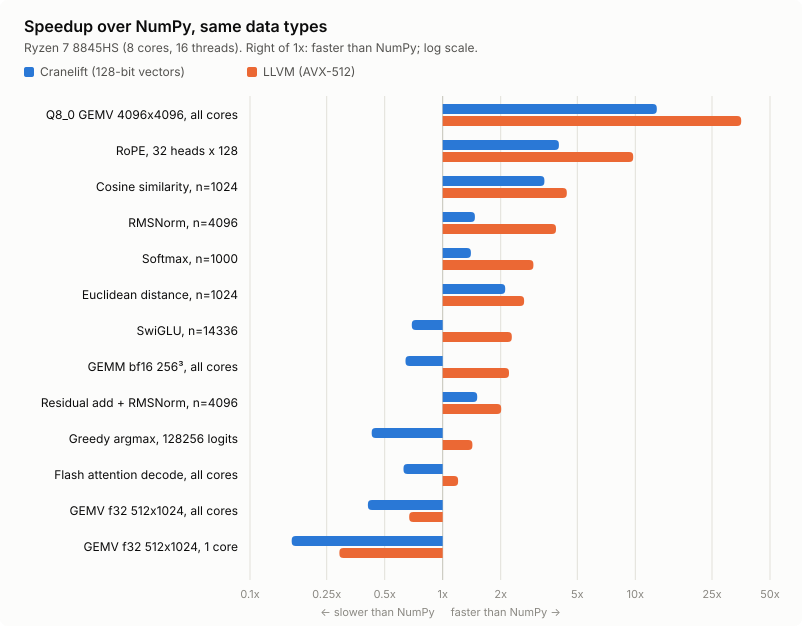

# achainsaw

[](https://github.com/javier-cabezas/achainsaw/actions/workflows/ci.yml)
[](https://github.com/javier-cabezas/achainsaw/actions/workflows/release.yml)
[](LICENSE)

> **High-Performance, Token-Minimal Compiler Toolchain Designed Exclusively for AI Agents**

`achainsaw` is a specialized compiler and JIT execution toolchain built from first principles for autonomous LLM agents. It completely discards human-centric syntactic sugar (no curly braces, no indentation sensitivity, no verbose keywords, no English prose compiler errors) to optimize for two uncompromising objectives:

1. **Minimize Agent Processing Time:** Autoregressive LLM decoding latency scales linearly with token count. `achainsaw` uses **AIR (Agent Intermediate Representation)**—a flat, sequential Single Static Assignment (SSA) format with single-token mnemonics. It eliminates nesting hallucinations and reduces token consumption by **60% to 80%** compared to traditional languages.
2. **Generate Highly Efficient Native Code as Fast as Possible:** Powered by **Cranelift** (the code generator behind Wasmtime), `achainsaw` compiles AIR modules directly to bare-metal x86_64 / AArch64 machine code with JIT compilation times under **10 milliseconds** and near-LLVM execution throughput.

---

## ⚡ Key Highlights

- **Linear SSA / Three-Address Code (TAC):** Zero nested expressions (`(+ (* a b) c)`). Eliminates bracket/parenthesis balancing errors and allows causal transformer attention heads to track dependencies with forward sequential ease.
- **Single-Token Mnemonics:** Operators and keywords (`fn`, `cst`, `add`, `mul`, `ld`, `st`, `br`, `jmp`, `ret`) map strictly to single, indivisible tokens in standard BPE vocabularies (OpenAI `cl100k`/`o200k`, Meta LLaMA 3, Google Gemini).
- **Machine-Native Diagnostic Protocol:** Zero natural-language prose error messages. Validation failures immediately produce structured JSON diagnostics with exact instruction indices, expected types, and candidate replacement patches for single-shot agent self-repair.
- **Width-Generic SIMD Vectors:** Fixed `v128`/`v256`/`v512` and scalable `vx` vectors with lane-typed ops (`vadd a, b:f32`) over i8/i16/i32/i64/f32/f64 lanes, fused multiply-add, compares and bitwise select, broadcast, lane extraction, lane permutations (interleave, deinterleave, reverse, broadcast a lane), and deterministic horizontal reductions (see [Vector Types & Ops](#-vector-types--ops-air-v2)).
- **One-Line Multi-Core Parallelism:** `par n, f(a, b)` runs `f(i, a, b)` for every `i < n` on all cores and joins, with no threads, locks or closures to get wrong (see [Parallel Loops](#-parallel-loops-par)).
- **Autonomous Dynamic Memory Management:** Built-in bare-metal heap allocator intrinsics (`alloc`, `free`) with 64-bit pointer arithmetic, allowing agents to dynamically allocate, reshape, and reclaim scratchpad buffers.
- **Sub-10ms Bare-Metal JIT:** Direct in-memory compilation and execution via Cranelift with native C-ABI compatibility for host interop.
- **High-Performance Memory Model:** Flat linear memory addressing (`ld`/`st`), 64-bit pointer arithmetic, and scalar numeric types (`i8`, `i16`, `i32`, `i64`, `f32`, `f64`, `ptr`, `v128`).

---

## 📐 Token Efficiency: AIR vs Traditional Code

### Vector Dot Product Kernel

#### Python (~68 tokens, slow runtime):
```python
def dot(a, b, n):
    acc = 0.0
    for i in range(n):
        acc += a[i] * b[i]
    return acc
```

#### C99 (~95 tokens, slow compilation):
```c
float dot(const float* a, const float* b, int n) {
    float acc = 0.0f;
    for (int i = 0; i < n; i++) {
        acc += a[i] * b[i];
    }
    return acc;
}
```

#### achainsaw AIR (~42 tokens, <5ms JIT compilation, native AVX speed):
```air
fn dot(p0:ptr, p1:ptr, n:i64)->f32
  b0:
    zero_f = cst 0.0:f32
    zero_i = cst 0:i64
    jmp b1(zero_i, zero_f)
  b1(i:i64, acc:f32):
    cond = lt i, n
    br cond, b2, b3
  b2:
    four = cst 4:i64
    byte_off = mul i, four
    p0_elem = add p0, byte_off
    p1_elem = add p1, byte_off
    v0 = ld p0_elem:f32
    v1 = ld p1_elem:f32
    prod = mul v0, v1
    next_acc = add acc, prod
    one = cst 1:i64
    next_i = add i, one
    jmp b1(next_i, next_acc)
  b3:
    ret acc
```

---

## 🧮 Vector Types & Ops

Vectors are untyped bit containers; every vector op names the lane type it works on, so one register can be read as `f32` lanes by one op and as `i32` lanes by the next.

| Type | Width | Notes |
|---|---|---|
| `v128`, `v256`, `v512` | 128/256/512 bits | Fixed width; usable in AIR function signatures |
| `vx` | Target maximum (at least 128 bits) | Scalable; `n = vl f32` gives its lane count. Usable in AIR function signatures, not in `extfn` ones |

| Op | Syntax | Lane types |
|---|---|---|
| Load / store | `v = ld p:v256`, `st p, v` | Any alignment |
| Masked load / store | `v = ldm p:vx, n:f32`, `stm p, v, n:f32` touch only the first `n` lanes (a masked load zeroes the rest) | Any |
| Broadcast | `v = splat x:v512` (the vector type is required) | i8 to f64 |
| Arithmetic | `r = vadd a, b:f32` (`vsub`, `vmul`, `vdiv`, `vmin`, `vmax`) | `vmul`: not i8; `vdiv`: f32/f64; `vmin`/`vmax`: not i64 |
| Bitwise | `r = vand a, b:i32` (`vor`, `vxor`) | Any |
| Fused multiply-add | `r = vfma a, b, c:f32` computes `a*b + c` with one rounding | f32, f64 |
| Int8 dot product | `r = vdot c, a, b:i8` adds to each i32 lane of `c` the four products of the matching i8 lanes of `a` and `b`, exactly (i32 wrapping). One `sdot` on NEON (FEAT_DotProd) and SVE; on x86 with VNNI, `vpdpbusd` on `a ^ 0x80` minus `128 * sum(b)` (it multiplies unsigned by signed bytes), on both backends | i8 |
| Compare | `m = vlt a, b:f32` (`veq`, `vne`, `vgt`, `vle`, `vge`) gives all-ones lanes where true | Any (signed for integers) |
| Select | `r = vsel m, a, b` takes bits of `a` where `m` is 1, else `b` | n/a |
| Reduce | `s = vsum v:f32` (`vmaxr`, `vminr`) | Any |
| Convert | `f = vitof v:f32` (i32 lanes to f32), `i = vftoi v:i32` (f32 to i32, saturating, NaN to 0); like scalar casts, the suffix is the result lane type | f32, i32 |
| Widen / narrow | `w = vwidenlo v:i16` / `vwidenhi` sign-extend the low / high half of the half-width lanes; `n = vnarrow a, b:i8` saturates both operands' lanes, `a`'s into the low half and `b`'s into the high half | widen: i16, i32, i64; narrow: i8, i16 |
| Half-precision floats | `w = vfwidenlo v:f16` / `vfwidenhi` convert the low / high half of the 16-bit float lanes to f32 (the suffix names the source; also `:bf16`); `n = vnarrow a, b:f16` converts f32 lanes to f16 or bf16, rounding to nearest-even like `ftrunc`. Exact and identical on both backends except NaN payloads; LLVM uses F16C or AArch64's `fcvtl`/`fcvtn` where available. `vl`, `ldm` and `stm` count f16/bf16 lanes too | f16, bf16 |
| Shift | `r = vshl v, s:i32` (`vshr` arithmetic, `vushr` logical) by a scalar amount, taken modulo the lane width | i8 to i64 |
| Absolute value / negate | `r = vabs v:i32`, `vneg`: integers wrap (`vabs` of the minimum is the minimum); floats clear or flip the sign bit, NaNs included | i8 to f64 |
| Square root | `r = vsqrt v:f32` (correctly rounded), `vrsqrt` computes `1 / vsqrt(v)` with two roundings, never a hardware estimate, so results are identical on every CPU | f32, f64 |
| Rounding | `r = vfloor v:f32`, `vceil`, `vround` (halfway cases away from zero, as C's `round`), `vroundeven` (to even), `vroundz` (toward zero) | f32, f64 |
| Copy sign | `r = vcopysign a, b:f32`: `a`'s magnitude with `b`'s sign bit | f32, f64 |
| Exponential | `e = vexp v:f32`: e^x within 2 ulp on [-87, 88], inputs clamped to that range, NaN propagated; a fixed algorithm, so results are bit-identical on every backend | f32 |
| Extract | `e = extlane v, 7:f32` | Index checked against the width (`vx`: its guaranteed 128 bits) |
| Broadcast a lane | `r = vdup v, 3:f32` puts lane 3 of `v` in every lane | Any, including f16/bf16; index checked as for `extlane` |
| Reverse | `r = vrev v:f32` reverses the order of the lanes | Any, including f16/bf16 |
| Interleave | `r = vziplo a, b:f32` gives `a0 b0 a1 b1 ...` from the low halves, `vziphi` the same from the high halves | Any, including f16/bf16 |
| Deinterleave | `r = vunziplo a, b:f32` gives the even lanes of `a` then of `b` (`a0 a2 ... b0 b2 ...`), `vunziphi` the odd lanes; they invert `vziplo`/`vziphi` | Any, including f16/bf16 |
| Lane count | `n = vl f32` | Any |

Semantics are identical on every backend: integer ops wrap, float `vmin`/`vmax` propagate NaN and order `-0.0` below `+0.0`, and reductions use a fixed recursive-halves order (`reduce(v) = op(reduce(lo), reduce(hi))`), so float sums are bit-reproducible for fixed widths.

**Permutations** (`vziplo`/`vziphi`, `vunziplo`/`vunziphi`, `vrev`, `vdup`) are defined relative to the vector's own lane count, so vector-length-agnostic code can use them on `vx` at any width: on SVE each is a single instruction (`zip1`/`zip2`, `uzp1`/`uzp2`, `rev`, `dup`) at every vector length. There is deliberately no shuffle by an index list, since its indices would depend on a width that `vx` code does not know. Zips and unzips cover the common layouts: pairs such as interleaved RoPE's `(x[2i], x[2i+1])` deinterleave with `vunziplo`/`vunziphi` and go back with `vziplo`/`vziphi`, and repeated zips transpose small tiles.

**Fast min/max:** float min/max (`min`, `max`, `vmin`, `vmax`, `vminr`, `vmaxr`) propagate NaN and order -0.0 below +0.0 by default. Compiling with fast math (`--fast-math` on `run`, `bench` and `build`, `fast_math=True` in Python's `compile`, `fast_math` in MCP `air_run`, `JitEngine::set_fast_math` or `CodegenOptions` in Rust) lowers the same instructions to compare and select instead, `max(a, b) = a > b ? a : b` and `min(a, b) = a < b ? a : b`, so a NaN operand or two zeros give `b`. That skips the NaN and signed-zero handling, which costs several instructions per op on 128-bit Cranelift vectors, and results stay identical on every backend (they are what x86's `maxps`/`minps` compute). Softmax runs 17% faster on Cranelift and 13% faster on LLVM with it; the kernel benchmarks below use it. Fast math also lets bf16 `mm` use AMX (`tdpbf16ps`) and SME (`bfmopa`), which treat bf16 subnormal inputs as zero; by default bf16 `mm` uses exact vector FMAs on those CPUs, so it widens every bf16 value exactly on every backend (int8, f16 and f32 `mm` use the matrix engines either way).

Vector-length-agnostic code processes `vl` lanes per iteration and finishes with masked accesses, as in [`examples/saxpy_vx.air`](examples/saxpy_vx.air):
```air
fn saxpy(a:f32, x:ptr, y:ptr, n:i64)
  b0:
    va = splat a:vx
    w = vl f32
    jmp vloop(0:i64)
  vloop(i:i64):
    more = lt i, n
    br more, vbody, done
  vbody:
    rest = sub n, i
    off = mul i, 4:i64
    px = add x, off
    py = add y, off
    xv = ldm px:vx, rest:f32
    yv = ldm py:vx, rest:f32
    r = vfma va, xv, yv:f32
    stm py, r, rest:f32
    i2 = add i, w
    jmp vloop(i2)
  done:
    ret
```

**Half-precision storage types:** `f16` (IEEE binary16) and `bf16` (bfloat16) can be loaded, stored, and converted (`f = fext h:f32`, `h = ftrunc f:bf16`, rounding to nearest-even; vectors with `vfwidenlo`/`vfwidenhi` and `vnarrow`), but not used in arithmetic or function signatures; convert to `f32` first.

**Standard library:** a top-level `use` line links functions from AIR's standard library, written in AIR ([`crates/achainsaw-ir/std/std.air`](crates/achainsaw-ir/std/std.air)), into the module, together with the library functions they call; they are then ordinary functions to `call` or run with `par`, and work the same in files, MCP `air_run`, Python and AOT builds.

```air
use quantize_q8, qmat_chunk

fn gemv_chunk(c:i64, mat:ptr, xq:ptr, dx:ptr, y:ptr, k:i64)
  b0:
    off = mul c, 256:i64
    yc = add y, off
    call qmat_chunk(c, mat, xq, dx, yc, k)
    ret
```

It holds the building blocks the example kernels share: `quantize_q8` (Q8_0 activations), `qmat_chunk` (64 output rows of a Q8_0, Q4_0 or Q6_K matrix), `rope_half`, `exp_shift` (softmax numerators) and `silu_mul` (SwiGLU). `achainsaw std` lists them with their documentation and `achainsaw std <name>` prints one's source; MCP clients have the `air_std` tool.

**Matrix multiply:** `mm pc, pa, pb, m, n, k:bf16` computes `C[m x n] += A[m x k] * B[k x n]` on row-major, contiguous matrices. `A`/`B` hold `bf16`, `f16`, or `f32` elements with an `f32` `C`, or `i8` elements with an `i32` `C` (exact, wrapping). Float accumulation order is implementation-defined, so results agree across backends within rounding error rather than bit for bit. Under a fuel budget, `mm` costs one unit per 1024 multiply-adds, charged before it starts.

On the LLVM backend, `mm` uses the best kernel the target has:

| Target | `mm` kernel |
|---|---|
| x86 with AMX (Sapphire/Emerald Rapids: bf16, i8; Granite Rapids: also f16) | 16x16 AMX tiles (`tdpbf16ps`, `tdpbssd`, `tdpfp16ps`) |
| AArch64 with SME (e.g. Apple M4) | ZA-tile outer products (`fmopa`, `bfmopa`, `smopa`) in streaming mode |
| Everything else | broadcast-FMA at full `vx` width (AVX-512/AVX2/SVE/NEON), 4 rows of C per B strip |

On a Zen 4 core (AVX-512), 256x256x256 `mm` runs at about 130 GFLOP/s for f32, 90 for bf16, 70 GOP/s for i8, and 29 for f16. Cranelift's 128-bit kernel reaches about 50, 32, 33 and 9. The AMX path is compiled and checked in assembly but has not run on AMX hardware yet. The SME path is tested under QEMU (`tools/qemu-aarch64/run.sh`); its objects call the SME ABI routine `__arm_tpidr2_save`, provided by GCC 14+ libgcc or compiler-rt.

**Backend support:** the default Cranelift backend runs every vector program, splitting `v256`/`v512` into 128-bit operations, treating `vx` as 128 bits, and running `mm` as 128-bit tiles (4 rows by 8 columns of C, with FMA where the CPU has it). The opt-in [LLVM backend](#10-choosing-a-backend---backend) uses the hardware's full width:

| Target (LLVM backend) | `vx` | Masked `ldm`/`stm` |
|---|---|---|
| x86_64 with AVX-512F | 512 bits (zmm) | AVX-512 k-masks |
| x86_64 with AVX2 | 256 bits (ymm) | `vmaskmov` |
| x86_64 SSE/AVX only, AArch64 NEON (including Apple M4) | 128 bits | per-lane |
| AArch64 with SVE | scalable, the CPU's vector length (`<vscale x ...>`) | `whilelo` predicates |

`v256`/`v512` map to native registers whenever the target has them. On SVE, horizontal reductions follow the same adjacent-pairs tree at the run-time vector length. Programs written against `vl` and `mm` speed up without changes. `vx` width therefore depends on the backend and CPU, so programs must use `vl` rather than assume a lane count; `JitEngine::vx_bits()` and `achainsaw cpu` report it.

## 🧩 Memory Operands, Several Results and Inline Functions

**Indexed operands.** `ld`, `st`, `ldm` and `stm` take `p[i]`, which addresses `p + i * size` for an i64 index: the size of the loaded or stored scalar, or the lane type of `ldm`/`stm`. A vector access, or a byte offset, names its unit: `p[i:f32]`, `p[o:i8]`. The sandbox checks the address the index computes.

```air
  body:
    rest = sub n, i
    g = ldm gate[i]:vx, rest:f32      # was: off = mul i, 4:i64; pg = add gate, off; g = ldm pg:vx, rest:f32
    st scores[t], s                   # s:f32 at scores + 4t
```

**Several results.** A function can return several values, `fn divmod(a:i64, b:i64)->(i64, i64)`, with `ret q, r`, received as `q, r = call divmod(x, 10:i64)`. Results of any type cross calls, `vx` included (on SVE, a struct of scalable vectors); hosts call only functions with at most one scalar result.

**Inline functions.** `inline fn` marks a helper whose calls are replaced by its body before compiling, on both backends, JIT and AOT (`achainsaw opt` shows the expansion). A straight-line helper merges into the caller's block, so it adds no branches and no fuel checks; inline functions cannot be recursive (`ERR_RECURSIVE_INLINE`). The standard library's quantized matrix kernels are built this way: `qmat_chunk` (1 token) and `qmat_chunk4` (4 tokens) call the same inline steps (`qmat_w8`/`qmat_w4`/`qmat_w6` unpack two weight vectors, `qmat_dot` runs one token's `vdot`s, `qmat_acc1`/`qmat_acc2` scale and accumulate), so every token's arithmetic is identical by construction, and `llama_decode.air` reads its tables with `load_cfg`, `model_globals` and `layer_weights`. Together with indexed operands, this cut the standard library from 712 to 447 lines of code (`qmat_chunk` 185 to 80, `qmat_chunk4` 335 to 114) and `llama_decode.air` from 718 to 637, without slowing anything down: in the base-vs-head benchmark comparison every kernel is within noise, and Cranelift's quantized GEMVs and prefill got 6–7% faster (its index shifts fold into x86 addressing modes).

**Scalar math.** Rounding to an integral value, `floor`, `ceil`, `round` (halfway away from zero), `roundeven` and `roundz` (toward zero); bit counts `popcnt`, `clz` and `ctz` (the bit width for 0); `copysign a, b` for floats, `rotl`/`rotr` for integers (amount modulo the width); `r = fma a, b, c` with one rounding; `uitof`/`ftoui` unsigned conversions (`ftoui` saturates, negative values and NaN to 0). All are single instructions or exact sequences, bit-identical on both backends and checked against Rust's own operations (`tests/scalar_math.rs`). `quantize_q8` rounds with `vround`, so it now matches llama.cpp's `roundf` exactly at halfway cases. These mnemonics are recognized only right after `=`, so programs that use them as register names still parse.

---

## 🧵 Parallel Loops (`par`)

`par n, f(a, b)` calls `f(i, a, b)` for every `i` in `0..n` across all cores and returns when every call has finished. It is the only parallel construct: no threads, futures, locks or closures. `f` is an ordinary AIR function whose first parameter is the `i64` index, followed by scalar or `ptr` parameters, and that returns nothing. Values the body needs are passed as arguments, exactly like `call`. From [`examples/kernels/gemv_par.air`](examples/kernels/gemv_par.air):

```air
fn gemv_par(a:ptr, x:ptr, y:ptr, m:i64, k:i64)
  b0:
    m15 = add m, 15:i64
    blocks = udiv m15, 16:i64
    par blocks, gemv_rows(a, x, y, m, k)    # gemv_rows(blk, a, x, y, m, k) does rows 16*blk..16*blk+15
    ret
```

The rules:
- **Write only your own memory.** Calls run concurrently and in any order. Each `i` writes its own memory; to reduce, store per-`i` partial results in an `alloc`'d array and sum them after the `par`.
- **Give each `i` real work.** A row or a block of thousands of elements works well. Dispatching a `par` costs a few microseconds.
- **The validator checks the body.** `ERR_PAR_SIGNATURE` reports a body with the wrong signature and gives the expected one in `context.expected_signature`. External functions (`extfn`) cannot be bodies, and vectors cannot be passed (pass them through memory).

How it runs:
- **Threads.** The calling thread works through the indices together with a process-wide pool of helper threads. Indices are handed out dynamically, so uneven iterations still balance. The pool has `ACHAINSAW_THREADS` threads in all (default: one per core). Helpers that just ran iterations spin for 200 µs before parking, so back-to-back `par` loops do not pay thread wake-ups; the window is short because spinning threads slow down other runtimes' thread pools (OpenBLAS, OpenMP) running in the same process. A `par` with fewer indices than threads uses only that many threads: the other helpers stay parked, so they neither slow down busy threads sharing their core nor need waking for later loops of the same size.
- **Thread cap.** Limit a run with `--threads` on `achainsaw run`, `threads` in MCP `air_run`, `Kernel.set_threads()` in Python, or `JitEngine::set_threads`. `1` runs serially, which makes it easy to measure the speedup.
- **Serial fallbacks.** A `par` inside a `par` body runs serially on its worker. So does a `par` started while another thread's `par` has the pool. AOT objects have no runtime, so `par` compiles to a plain loop there; any order is a valid execution.
- **Fuel.** The fuel budget is shared: each index costs one unit, plus the usual unit per branch. A parallel run therefore uses exactly the fuel of a serial one, and a runaway iteration still ends with `ERR_OUT_OF_FUEL`.
- **Errors and sandbox.** The first failure in any worker stops all of them and is reported from the `par`: `ERR_MEMORY_VIOLATION`, `ERR_STACK_OVERFLOW` or `ERR_OUT_OF_MEMORY`. Sandboxed bodies share the caller's arena and may `alloc`/`free` scratch memory.
- **Python.** `Kernel.run` releases the GIL, so host callbacks can run on `par` workers, and other Python threads keep running.

Speedup of `gemv_par`'s `bench` driver on a Ryzen 7 8845HS (8 cores, 16 threads), from `achainsaw run examples/kernels/gemv_par.air --func bench --args M,K,REPS --threads T`:

| Shape | Backend | 1 thread | 16 threads | Speedup |
|---|---|---|---|---|
| 4096x4096 (64 MB), 50 runs | Cranelift | 632 ms | 75 ms | 8.4x |
| 4096x4096 (64 MB), 50 runs | LLVM (AVX-512) | 180 ms | 74 ms (8 threads) | 2.4x (memory-bound) |
| 1024x512 (2 MB), 2000 runs | Cranelift | 685 ms | 83 ms | 8.3x |
| 1024x512 (2 MB), 2000 runs | LLVM (AVX-512) | 81 ms | 27 ms | 3.1x (2000 `par` dispatches) |

---

## 🛠️ CLI & Agent Usage

### 1. Validate Syntax & SSA Invariants (`--json`)
```bash
achainsaw check examples/sum_loop.air --json
```

**Output:**
```json
{
  "status": "ok",
  "function_count": 1,
  "functions": ["sum_to_n"],
  "block_count": 4,
  "instruction_count": 7
}
```

### 2. Machine-Native Diagnostic on Errors
If an agent hallucinates an undefined register:
```json
{
  "status": "error",
  "error_code": "ERR_UNDEFINED_REG",
  "instruction_index": 0,
  "message": "Register 'undefined_var' is used before definition",
  "span": {
    "start": 42,
    "end": 55,
    "line": 4,
    "column": 16
  },
  "context": {
    "target": "undefined_var",
    "available_registers": ["a", "b", "cst0"]
  }
}
```

### 3. Compile and Run via Cranelift JIT
```bash
achainsaw run examples/sum_loop.air --func sum_to_n --args 100 --json
```

**Output:**
```json
{
  "status": "ok",
  "function": "sum_to_n",
  "result": 5050,
  "parse_time_us": 62,
  "compile_time_us": 3120,
  "exec_time_us": 1,
  "total_time_ms": 3.25
}
```

### 4. Benchmark JIT Compilation Latency
```bash
achainsaw bench examples/fibonacci.air --iters 200
```

### 5. Assemble & Disassemble Compact Binary Bytecode (`.airb`)
AIR modules can be assembled into compact binary bytecode for persistent caching, agent-to-agent IPC, and zero-parse reloading. Every AIR construct round-trips through AIRB, and files carry a format version that decoders check:
```bash
# Assemble text AIR to compact binary bytecode (.airb)
achainsaw assemble examples/fibonacci.air -o examples/fibonacci.airb --json

# Direct execution of pre-parsed binary bytecode
achainsaw run examples/fibonacci.airb --func fib --args 30 --json

# Disassemble binary bytecode back into canonical text AIR
achainsaw disassemble examples/fibonacci.airb
```

### 6. Model Context Protocol (MCP) Server (`achainsaw mcp`)
`achainsaw` includes a native Model Context Protocol (MCP) server communicating over JSON-RPC 2.0 stdio, exposing compiler tools directly to LLM agents and IDE assistants:
```bash
achainsaw mcp
```

**Exposed MCP Tools:**
- **`air_check`**: Validates AIR textual IR or base64 AIRB bytecode syntax and SSA invariants. Returns structured diagnostic metrics or error payloads with line/column pointers and self-repair hints.
- **`air_run`**: JIT compiles and executes AIR functions with arguments, loop fuel budget, and memory quota sandboxing. Code runs in a sandbox: memory comes only from `alloc` within a private arena (`max_memory_mb`, default 64), out-of-bounds accesses and bad `free`s fail with `ERR_MEMORY_VIOLATION`, unbounded recursion with `ERR_STACK_OVERFLOW`, and pointer parameters are rejected.
- **`air_assemble`**: Assembles textual AIR into compact base64-encoded AIRB bytecode with compression metrics.
- **`air_disassemble`**: Decompiles base64 AIRB bytecode back into canonical, human/agent-readable textual AIR.
- **`air_optimize`**: Optimizes IR using constant folding, algebraic simplification, branch folding, and DCE to a fixpoint.
- **`air_target`**: Reports the host's vector features (AVX/AVX2/AVX-512/AMX, NEON/SVE/SME), the active ISA cap, and each backend's vector width (see [CPU Features & ISA Targeting](#9-cpu-features--isa-targeting-achainsaw-cpu)).

The `initialize` response includes server `instructions`, a compact AIR syntax primer that MCP clients inject into the model's context. That lets an agent write valid AIR on the first attempt without this README.

#### Using with Claude Code
The repository ships a project-scoped [`.mcp.json`](.mcp.json) that runs the server via `cargo run --release`. Build once so the first startup does not exceed the MCP connection timeout, then start Claude Code in the repo and approve the `achainsaw` server when prompted:
```bash
cargo build --release -p achainsaw
claude
```

To make the tools available in every project, register an installed binary at user scope instead:
```bash
cargo install --path crates/achainsaw-cli
claude mcp add --scope user achainsaw -- achainsaw mcp
```

#### Using with Claude Desktop
Add the server to `claude_desktop_config.json` (macOS: `~/Library/Application Support/Claude/`, Windows: `%APPDATA%\Claude\`), using the absolute path to the binary, then restart Claude Desktop:
```json
{
  "mcpServers": {
    "achainsaw": {
      "command": "/absolute/path/to/achainsaw",
      "args": ["mcp"]
    }
  }
}
```

### 7. IR Optimization Engine (`achainsaw opt`)
Pre-evaluate constant expressions, simplify algebraic identities (`x + 0 -> x`, `x * 1 -> x`), fold invariant branches, and eliminate dead code and unreachable blocks:
```bash
achainsaw opt examples/opt_demo.air --json
```

**Optimization Telemetry:**
```json
{
  "status": "ok",
  "constants_folded": 2,
  "algebraic_simplifications": 1,
  "branches_folded": 0,
  "dead_instructions_removed": 6,
  "dead_blocks_removed": 1,
  "total_optimizations": 10,
  "iterations": 2,
  "code": "fn demo(x:i32)->i32\n  b0:\n    ret x\n"
}
```

### 8. Ahead-Of-Time (AOT) Compilation (`achainsaw build`)
Compile AIR modules into native object files (`.o`) or linked shared libraries (`.so` / `.dll`) for direct embedding into C, C++, Rust, or Python programs via standard C ABI:
```bash
# Compile to native object file (.o)
achainsaw build examples/fibonacci.air -o examples/fibonacci.o --json

# Compile and link directly into shared library (.dll / .so)
achainsaw build examples/fibonacci.air --shared --json
```

**Build Telemetry:**
```json
{
  "status": "ok",
  "input": "examples/fibonacci.air",
  "output": "examples/fibonacci.dll",
  "object_bytes": 265,
  "shared": true,
  "parse_time_us": 304,
  "compile_time_us": 2563,
  "link_time_us": 112751,
  "total_time_ms": 116.0
}
```

### 9. CPU Features & ISA Targeting (`achainsaw cpu`)
Report the host's vector ISA features (feature names use LLVM spelling), the active ISA cap, and the vector width each code generation backend uses:
```bash
achainsaw cpu
```

```json
{
  "status": "ok",
  "host": {
    "arch": "x86_64",
    "features": ["sse3", "ssse3", "sse4.1", "sse4.2", "popcnt", "cx16", "avx", "f16c", "avx2", "fma", "...", "avx512f", "avx512vl", "avx512bw", "avx512bf16"],
    "max_isa": "avx512",
    "native_vector_bits": 512,
    "sve_vector_bits": null,
    "sme_vector_bits": null
  },
  "isa_cap": null,
  "effective": { "...": "host features after the ISA cap" },
  "backends": {
    "cranelift": { "available": true, "vector_bits": 128, "unused_features": ["f16c", "avx512bw", "avx512cd", "avx512bf16"] },
    "llvm": { "available": false }
  }
}
```

Detection covers SSE through AVX-512 (including BF16/FP16/VNNI) and AMX on x86_64, and NEON, SVE/SVE2 (with vector length), and SME/SME2 on AArch64. Cranelift emits 128-bit vector code (using VEX/EVEX encodings when AVX/AVX-512 are available) and runs `v256`/`v512`/`vx` programs as 128-bit operations. The LLVM backend, when built in, uses every enabled feature, and `backends.llvm` reports `"available": true` with its `vx` width (`vector_bits`) and whether `vx` is scalable (`vx_scalable`, on SVE).

**Cap the ISA level** to exercise lower tiers on a more capable machine (for example, AVX2 code on an AVX-512 host). Levels: `sse`, `avx`, `avx2`, `avx512`, `amx` (x86_64) and `neon`, `sve`, `sve2`, `sme` (AArch64):
```bash
achainsaw run examples/sum_loop.air --func sum_to_n --args 100 --isa avx2
ACHAINSAW_MAX_ISA=sse achainsaw mcp      # every JIT compilation in the server is capped
```

**Target a specific CPU in AOT builds** with LLVM CPU names and feature strings. `+feature` also enables its prerequisites and `-feature` disables everything that depends on it, as in LLVM. Features the backend cannot use are listed in `ignored_features`:
```bash
achainsaw build examples/kernels/gemv_f32.air --target-cpu x86-64-v3
achainsaw build examples/kernels/gemv_f32.air --target-cpu znver4 --target-features -avx512f
achainsaw --backend llvm build examples/kernels/gemv_f32.air --target-cpu sapphirerapids --emit asm   # writes gemv_f32.s
```

---

## ⚡ Chainsaw-BLAS: High-Performance Agent AI Kernel Library

`examples/kernels/` holds verified kernels for LLM inference, vector search, and normalization. They are vector-length agnostic: each processes `vl` lanes per step with FMAs and finishes with masked `ldm`/`stm`, so the same source runs 128-bit vectors on Cranelift and AVX2/AVX-512/SVE-width vectors on LLVM. Every kernel takes element counts, and each `.air` file has matching `.airb` bytecode.

| Kernel | Signature | Use case |
|---|---|---|
| `cosine_similarity.air` | `(a:ptr, b:ptr, n:i64)->f32` | Embedding search and RAG |
| `euclidean_distance.air` | `(a:ptr, b:ptr, n:i64)->f32` | Nearest neighbors, vector quantization |
| `softmax.air` | `(x:ptr, out:ptr, n:i64)->f32` (returns the sum of exponentials) | Attention weights, numerically stable; `exp` vectorized in AIR (no libm call) |
| `rmsnorm.air` | `(x:ptr, w:ptr, out:ptr, n:i64)->f32` (returns the scale) | Token normalization (LLaMA, Mistral, Gemma) |
| `gemv_f32.air` | `(a:ptr, x:ptr, y:ptr, m:i64, k:i64)` | Matrix-vector projection, 4 rows at a time (independent FMA chains, x loaded once per 4 rows) |
| `gemv_par.air` | `gemv_par(a:ptr, x:ptr, y:ptr, m:i64, k:i64)` | The same on all cores, blocks of 16 rows per `par` index; `bench(m, k, reps)->f32` runs it from the CLI or MCP |
| `gemm_bf16.air` | `gemm_bf16(c:ptr, a:ptr, b:ptr, m:i64, n:i64, k:i64)` | bf16 matrix multiply into f32 on all cores: `par` over 16-row blocks, each an `mm` (AMX, SME or FMA) |
| `flash_attention.air` | `(q:ptr, kv:ptr, idx:ptr, sink:ptr, out:ptr, h:i64, d:i64, nk:i64, scale:f32)` | One decode step of sparse multi-query attention with an attention sink, as in DeepSeek V4 Pro (128 heads, 512-dim shared K=V entries, 1152 selected entries). Runs on all cores: one `par` gathers the selected entries, a second runs FlashAttention-2 (blocks of 64 entries, both products on `mm`) for groups of 8 heads |
| `add_rmsnorm.air` | `(x:ptr, res:ptr, w:ptr, out:ptr, n:i64, eps:f32)->f32` | Residual add fused with RMSNorm between sublayers (vLLM's `fused_add_rms_norm`): updates the residual stream and normalizes it in two passes |
| `rope.air` | `(x:ptr, heads:i64, dim:i64, cos:ptr, sin:ptr)` | Rotary position embedding in place, LLaMA/NeoX rotate-half layout, from a row of the cos/sin cache |
| `swiglu.air` | `(gate:ptr, up:ptr, out:ptr, n:i64)` | `silu(gate) * up` with `exp` vectorized in AIR (Cephes polynomial; 2^n built by reading the f32 lanes as i32), no libm call |
| `argmax.air` | `(x:ptr, n:i64)->i64` | Greedy decoding: first index of the largest logit, one pass with four independent (value, index) accumulator sets |
| `q8_gemv.air` | `q8_gemv(wq:ptr, scales:ptr, x:ptr, y:ptr, m:i64, k:i64)` | Q8_0 (llama.cpp) matrix-vector product on all cores: int8 weights in 32-blocks with f16 scales (as GGUF stores them), packed in 64-row chunks with each row's 4 consecutive values in one 32-bit lane; activations quantized on the fly; int8 dots on `vdot` |
| `q4_gemv.air` | `q4_gemv(wq:ptr, scales:ptr, x:ptr, y:ptr, m:i64, k:i64)` | Q4_0 (llama.cpp) matrix-vector product: 4-bit weights, half of Q8_0's bytes; GGUF's own nibble bytes in the same lane order, unpacked in registers (a mask, a shift, a subtraction) for the same `vdot`s |
| `llama_decode.air` | `llama_decode(model:ptr, cfg:ptr, cache:ptr, token:i64, pos:i64, h:ptr, eps:f32)->i64`, `llama_prefill(model:ptr, cfg:ptr, cache:ptr, tokens:ptr, n:i64, pos:i64, h:ptr, eps:f32)->i64` | A whole Llama-style decode step in one call, token in, next token out; and a whole prompt in one call: see [Single-call decode](#single-call-decode-deep-fusion) |

`crates/achainsaw-codegen/tests/kernels.rs` checks every kernel against a scalar reference at each ISA level, including lengths that end in partial vectors. The benchmark verifies them against NumPy and times each backend and ISA level:

```bash
python benchmarks/benchmark_kernels.py                  # host ISA, every available backend
python benchmarks/benchmark_kernels.py --isa all        # also sweep sse/avx/avx2/avx512 (or neon/sve/...)
python benchmarks/benchmark_kernels.py --json out.json  # machine-readable results
```

Compared with NumPy on the same data types (bf16 inputs are stored as bf16 bits and widened in each call, Q8_0 and Q4_0 weights stay integers; NumPy's GEMV/GEMM use multithreaded OpenBLAS), from `benchmarks/benchmark_kernels.py` on a Ryzen 7 8845HS (8 cores, 16 threads). Kernels marked "all cores" use `par`; the others run on one core:

<picture>
  <source media="(prefers-color-scheme: dark)" srcset="docs/kernels-vs-numpy-dark.svg">
  
</picture>

| Kernel | NumPy | Cranelift (128-bit) | LLVM (512-bit) |
|---|---|---|---|
| Q4_0 GEMV 4096x4096, all cores | 5.63 ms (the same, from 4-bit values) | 247 µs (22.9x) | 62.5 µs (90.2x) |
| Q8_0 GEMV 4096x4096, all cores | 5.73 ms (int8 widened to f32 per call; NumPy has no int8 matmul) | 254 µs (22.6x) | 76.4 µs (75.0x) |
| RoPE, 32 heads x 128 | 7.7 µs | 1.9 µs (4.0x) | 0.86 µs (9.0x) |
| Residual add + RMSNorm, n=4096 | 6.1 µs | 4.1 µs (1.5x) | 1.6 µs (3.9x) |
| Cosine similarity, n=1024 | 2.2 µs | 0.70 µs (3.1x) | 0.56 µs (3.9x) |
| RMSNorm, n=4096 | 5.4 µs | 3.8 µs (1.4x) | 1.4 µs (3.8x) |
| Softmax, n=1000 | 2.8 µs | 1.8 µs (1.6x) | 0.92 µs (3.1x) |
| Euclidean distance, n=1024 | 1.3 µs | 0.69 µs (1.9x) | 0.56 µs (2.4x) |
| SwiGLU, n=14336 | 10.5 µs | 14.4 µs (0.73x) | 4.7 µs (2.2x) |
| GEMM bf16 -> f32, 256³, all cores | 156 µs | 204 µs (0.77x) | 75.1 µs (2.1x) |
| Greedy argmax, vocabulary 128256 | 6.4 µs | 15.8 µs (0.41x) | 4.5 µs (1.4x) |
| Flash attention decode, DeepSeek V4 Pro, all cores | 1.25 ms | 1.86 ms (0.68x) | 974 µs (1.3x) |
| GEMV f32 512x1024, all cores | 5.4 µs | 14.4 µs (0.38x) | 10.7 µs (0.51x) |
| GEMV f32 512x1024, 1 core | 5.4 µs (all cores) | 36.9 µs (0.15x) | 21.0 µs (0.26x) |

`python benchmarks/plot_vs_numpy.py results.json docs/kernels-vs-numpy` redraws the figure from `benchmark_kernels.py --json results.json`.

Every pull request also runs a performance check in CI: [`benchmarks/perf_compare.py`](benchmarks/perf_compare.py) builds the PR's base and head on the same runner, runs each side's kernel benchmarks and a 4-layer decode alternately for 5 rounds, and fails if the best time of any kernel on either backend got more than 25% slower. Comparing best times from fresh processes keeps runner noise out; the job summary lists every ratio.

Where the remaining gaps come from:
- **Cranelift's vector width.** Cranelift has only 128-bit vectors, so vector-bound kernels (SwiGLU, argmax, and `mm` in GEMM and attention) do a quarter of the work per instruction of AVX-512 code; on LLVM the same sources beat NumPy.
- **f32 GEMV against multithreaded BLAS.** The 2 MB matrix is cache-resident across calls: OpenBLAS splits it statically, so each core finds its rows in its own L2, while `par` hands rows out dynamically (better under uneven work, worse for this cache reuse) and adds about 2.7 µs of dispatch at 16 threads. The single-core row compares one core with NumPy's 16 threads.

**Quantized GEMV on `vdot`.** Each 32-bit lane of the packed weights holds 4 consecutive values of one row, so one `vdot` (VNNI `vpdpbusd`, Arm `sdot`) does 4 int8 multiply-adds per lane against a broadcast group of 4 activations, and a Q4_0 nibble vector unpacks into two such vectors in registers. Every task walks its 64-row chunk block by block, so each block's bytes are read in one pass (walking each row strip through the whole chunk instead strided through 256 KB and fell out of L3). Against the previous kernels, which unpacked into a tile for an i8 `mm`, the 4096x4096 GEMVs got 2.0–2.3x faster on LLVM and 1.6–1.9x on Cranelift, and Q4_0 is now faster than Q8_0 on both.

Fuel checks are inline (a decrement and a compare per branch, on a counter kept in a register), so loops pay almost nothing for runaway protection. The rare slow path calls the runtime through a stub that preserves every register, so it does not make Cranelift spill loop values: before that, the fuel checks made Cranelift's GEMV 2.6x slower.

#### Single-call decode (deep fusion)

[`examples/kernels/llama_decode.air`](examples/kernels/llama_decode.air) runs a whole decode step of a Llama-style model (RMSNorm, grouped-query attention with RoPE and a KV cache, SwiGLU MLP, Q4_0/Q8_0/Q6_K weights) in one call: the token id goes in, the greedy next token comes out. Like GPU megakernels ([Hazy Research's Llama-1B megakernel](https://hazyresearch.stanford.edu/blog/2025-05-27-no-bubbles), [AutoMegaKernel](https://arxiv.org/pdf/2606.09682)), it removes the boundaries between the ~100 small kernels of a forward pass; on a CPU that means each elementwise op runs inside the pass that produces or consumes its data:

| Pass | Fused into it |
|---|---|
| RMSNorm (serial) | Q8 quantization of its output |
| QKV projection (`par`, one task per head) | RoPE, KV-cache append |
| Attention (`par`, one task per q head) | vectorized softmax `exp`, Q8 quantization of its output |
| O and down projections (`par`, 64 rows per task) | residual add |
| Gate and up projections (`par`, 64 rows per task) | SwiGLU, Q8 quantization |
| LM head (`par`, 64 rows per task) | argmax: each task keeps only its best logit, so the logits are never written |

That is 2 serial norms and 5 `par` regions per layer. Each weight matrix has its own format, Q8_0, Q4_0 or Q6_K, in the chunked layout of `q8_gemv` and `q4_gemv` (Q6_K adds a plane of high bits and a scale per 16 values), so every task owns its output rows and applies its epilogue without a cross-task reduction. `crates/achainsaw-codegen/tests/llama_decode.rs` checks it against an f64 reference model, with all three formats mixed, over several positions, at every ISA level on both backends.

**Prefill.** `llama_prefill` runs a whole prompt of n tokens through the same passes in one call. Every projection task applies its rows to 4 tokens per weight load (`qmat_batch`, which runs the standard library's `qmat_chunk4` on tiles of 4 tokens and `qmat_chunk` on the rest), so the weights are read once per 4 tokens instead of once per token, and the work turns from memory-bound into compute-bound. Norms, RoPE, epilogues and attention (each token over the cache up to its own position) run per token. Each token's operations are exactly those of `llama_decode`, so a prefill leaves the same KV cache, hidden state and next token bit for bit as decoding the prompt token by token (`llama_prefill_matches_decode_exactly`, in one call or in pieces).

**A real model.** [`benchmarks/gguf.py`](benchmarks/gguf.py) reads llama.cpp's GGUF files with NumPy alone (metadata, tensors, dequantization of Q4_0, Q4_1, Q8_0, Q6_K, F16, BF16 and F32, and the Llama 3 BPE tokenizer, which gives the same ids as `llama-tokenize`), and [`benchmarks/llama_model.py`](benchmarks/llama_model.py) converts a Llama checkpoint for the kernel: Q4_0 and Q8_0 matrices bit for bit, Q6_K values bit for bit with each 16-value scale (super-block scale times sub-block scale) rounded to f16, anything else to Q8_0; Q and K rows back from llama.cpp's interleaved RoPE order; RoPE tables with Llama 3's frequency factors. The prompt goes through `llama_prefill`, then each new token through `llama_decode`.

```bash
curl -LO https://huggingface.co/bartowski/Llama-3.2-1B-Instruct-GGUF/resolve/main/Llama-3.2-1B-Instruct-Q4_0.gguf
python benchmarks/benchmark_decode.py --gguf Llama-3.2-1B-Instruct-Q4_0.gguf --threads 8 --tokens 64
#  ' Paris. The capital of Germany is Berlin. The capital of Italy is Rome. The capital of ...
```

Llama 3.2 1B Instruct in Q4_0 (Q4_0 layers, two Q4_1 down projections, a Q6_K embedding shared with the LM head), greedy decoding on a Ryzen 7 8845HS with 8 threads (one per core, the fastest setting for both):

| | ms/token | tokens/s | weights read per token |
|---|---|---|---|
| llama.cpp (CPU, `llama-bench -n 64 -t 8`) | 15.4 | 64.8 | 765 MB at 50 GB/s |
| AIR on LLVM, one call per token | 15.4 | 65.1 | 794 MB at 52 GB/s |
| AIR on Cranelift, one call per token | 24.8 | 40.4 | 794 MB at 32 GB/s |
| NumPy, same data types | 578 | 1.7 | |

The kernel prints the same text as llama.cpp (`llama-simple`, greedy), and its tokens match the NumPy implementation of the same arithmetic. Both are bound by memory bandwidth at about the same rate; the kernel reads 4% more bytes, because the two Q4_1 matrices become Q8_0 and its Q6_K scales take 0.5 bit more per weight than llama.cpp's packing.

Prefill of a 542-token prompt (`--prompt` with a long text), against the decode steps that follow it in the same run (one `llama_decode` call per token, the cost of feeding a prompt without prefill):

| | `llama_prefill`, ms/token | tokens/s | `llama_decode`, ms/token |
|---|---|---|---|
| AIR on LLVM | 2.32 | 432 | 16.3 |
| AIR on Cranelift | 11.8 | 85 | 28.0 |

**Q4 against Q8.** On a random model with the same shapes (`benchmark_decode.py --weights q8|q4`; d 2048, 16 layers, 32 query heads over 8 KV heads of 64, MLP 8192, vocabulary 128256), all Q8_0 or all Q4_0, 8 threads:

| Weights | AIR on LLVM | AIR on Cranelift | NumPy, same data types |
|---|---|---|---|
| Q8_0, 1.31 GB | 26.0 ms/token (38 tokens/s, 51 GB/s) | 28.7 ms/token | 558 ms/token |
| Q4_0, 0.70 GB | 13.1 ms/token (76 tokens/s, 53 GB/s) | 23.7 ms/token | 608 ms/token |

On LLVM decode streams the weights at close to the memory's bandwidth (run to run, about ±5%), so Q4_0 is about 2x faster than Q8_0. On Cranelift, `vdot` and in-register unpacking make the int8 dots cheap enough that Q4_0's half-size weights pay off too. NumPy, lacking an int8 matrix product, widens every weight to f32 on each token.

### 10. Choosing a Backend (`--backend`)
Two code generators share one runtime, so fuel budgets, memory quotas, the MCP sandbox, and the results of scalar and fixed-width vector code are the same on both (`vx` code computes the same values, but `vl` can be larger on LLVM):

| Backend | Compile latency (release, simple kernel) | Code | Availability |
|---|---|---|---|
| `cranelift` | ~0.2–0.3 ms | 128-bit vectors | always |
| `llvm` | ~5–7 ms | fully optimized; full-width AVX2/AVX-512/SVE vectors (`vx` up to 512 bits or scalable) | builds with the `llvm` feature |

Pick one with `--backend` on `run`, `bench` and `build`, the `ACHAINSAW_BACKEND` environment variable, `backend=` in Python, or the `backend` argument of MCP `air_run`. `auto` (the default) uses LLVM, when it is built in, for modules that use `v256`, `v512`, `vx`/`vl` or `mm`, and Cranelift otherwise, so scalar code keeps sub-millisecond compiles. For example, [`examples/saxpy_vx.air`](examples/saxpy_vx.air) on an AVX-512 machine runs 3–4x faster on LLVM.

```bash
# Build with the LLVM backend (needs LLVM 22, e.g. apt install llvm-22-dev)
export LLVM_SYS_221_PREFIX=/usr/lib/llvm-22
cargo build --release -p achainsaw --features llvm

achainsaw --backend llvm run examples/fibonacci.air --func fib --args 30
achainsaw --backend llvm build examples/kernels/gemv_f32.air --target-cpu znver4 --shared
ACHAINSAW_BACKEND=llvm achainsaw mcp     # every air_run in the server uses LLVM
```

AOT builds with `--backend llvm` accept the same `--target`, `--target-cpu` and `--target-features` options and can use every feature (nothing ends up in `ignored_features`). `crates/achainsaw-codegen/tests/backend_parity.rs` checks that both backends agree bit for bit, including on division by zero, out-of-range shifts, NaN handling, and saturating conversions.

---

## 🐍 Python Host Integration (`achainsaw-py`)

For AI agent orchestrators (LangGraph, AutoGen, CrewAI, DSPy), `achainsaw` provides native in-process Python bindings via PyO3 with **zero-copy NumPy memory integration** and microsecond compilation throughput.

### Installation / Build
```bash
pip install .                                     # or, with the LLVM backend:
MATURIN_PEP517_ARGS="--features llvm" pip install .
# then: achainsaw.compile(src, backend="llvm"); achainsaw.available_backends()

cargo build --release -p achainsaw-py
cp target/release/achainsaw.dll achainsaw.pyd  # Windows
# or cp target/release/libachainsaw.so achainsaw.so  # Linux
```

### Microsecond JIT & Zero-Copy NumPy Execution
```python
import achainsaw
import numpy as np

# In-place 128-bit SIMD vector scaling kernel
kernel = achainsaw.compile("""
fn simd_scale(p:ptr, factor:f32, n:i64)
  b0:
    vfactor = splat factor:v128
    zero = cst 0:i64
    jmp b1(zero)
  b1(i:i64):
    cond = lt i, n
    br cond, b2, b3
  b2:
    sixteen = cst 16:i64
    off = mul i, sixteen
    elem_ptr = add p, off
    v = ld elem_ptr:v128
    vscaled = vmul v, vfactor:f32
    st elem_ptr, vscaled
    one = cst 1:i64
    next_i = add i, one
    jmp b1(next_i)
  b3:
    ret
""")

# Contiguous NumPy float32 array
arr = np.array([1.0, 2.0, 3.0, 4.0, 5.0, 6.0, 7.0, 8.0], dtype=np.float32)

# Direct zero-copy mutation in native SIMD registers
kernel.run("simd_scale", arr, 2.5, 2)
print(arr)  # [ 2.5, 5.0, 7.5, 10.0, 12.5, 15.0, 17.5, 20.0 ]
```

### Autonomous Agent Self-Repair via Structured Diagnostics
```python
try:
    achainsaw.compile(bad_air_code)
except achainsaw.CompilationError as e:
    # Machine-native structured dictionary — zero regex or prose parsing needed
    diag = e.diagnostic
    print(diag["error_code"])                         # "ERR_UNDEFINED_REG"
    print(diag["context"]["target"])                  # "bad_register"
    print(diag["context"]["available_registers"])     # ["a", "b"]
    
    # Instant single-shot repair by LLM agent
    repaired_code = bad_air_code.replace(
        diag["context"]["target"],
        diag["context"]["available_registers"][0]
    )
    k = achainsaw.compile(repaired_code)
```

### CPU Features & ISA Cap in Python
```python
report = achainsaw.cpu_features()       # same report as `achainsaw cpu`
print(report["host"]["max_isa"])        # e.g. "avx512"

achainsaw.set_isa_cap("avx2")           # kernels compiled from now on use at most AVX2
kernel = achainsaw.compile(air_kernel)
achainsaw.set_isa_cap(None)             # remove the cap
```

### Binary Bytecode (AIRB) in Python
```python
# Assemble to compact binary payload (for caching or network transfer)
binary_payload = achainsaw.assemble(air_kernel)

# Directly compile pre-parsed binary bytecode (<0.05 ms)
kernel = achainsaw.compile_binary(binary_payload)
result = kernel.run("simd_scale", arr, 2.5, 2)

# Disassemble binary payload back into canonical text AIR
text_ir = achainsaw.disassemble(binary_payload)
```

### ⚡ Performance Comparison

| Metric | Subprocess CLI (`achainsaw.exe`) | In-Process Python (`achainsaw-py`) | Speedup |
| :--- | :--- | :--- | :--- |
| **JIT Compilation Latency** | ~7.95 ms / compile | **0.136 ms / compile** | **58.3x faster** |
| **Compilation Throughput** | ~125 compiles/sec | **7,340+ compiles/sec** | **58.3x throughput** |
| **Execution Call Overhead** | ~7.5 ms (process spawn) | **0.249 µs / call** | **>30,000x faster** |
| **Execution Call Rate** | ~130 calls/sec | **4,011,000+ calls/sec** | **4.0M calls/sec** |
| **NumPy Array Memory** | Serialization required | **Zero-copy (direct pointer)** | **0 MB allocated** |

---

## 🔗 Foreign Function Interface (FFI) & External Symbols

`achainsaw` can seamlessly call functions and access variables from external C/C++ libraries, Python extensions, and system shared objects (`.dll`, `.so`, `.dylib`).

### 1. Minimal `extfn` Syntax
External functions are declared with the token-minimal `extfn` keyword and invoked with standard `call`:
```air
extfn sinf(x:f32)->f32
extfn cosf(x:f32)->f32
extfn sqrtf(x:f32)->f32

fn compute_sincos_norm(x:f32)->f32
  b0:
    s = call sinf(x)
    c = call cosf(x)
    s2 = mul s, s
    c2 = mul c, c
    sum = add s2, c2
    norm = call sqrtf(sum)
    ret norm
```

### 2. Pre-Registered Standard C Math Intrinsics
The JIT engine pre-registers high-performance standard C math functions out of the box with zero runtime overhead:
- **32-bit float:** `sinf`, `cosf`, `tanf`, `sqrtf`, `expf`, `logf`, `powf`, `fabsf`, `floorf`, `ceilf`, `roundf`
- **64-bit float:** `sin`, `cos`, `tan`, `sqrt`, `exp`, `log`, `pow`, `fabs`, `floor`, `ceil`, `round`

### 3. Dynamic Shared Library Loading (`.dll` / `.so`)
Load any dynamic library at runtime. Exported C symbols are resolved automatically during JIT linking:
```python
import achainsaw

# Dynamically load a shared library
achainsaw.load_library("libcustom_math.so")  # or "custom_math.dll"

# Execute kernel calling symbols from the loaded library
kernel = achainsaw.compile("""
extfn custom_dsp_filter(input:ptr, output:ptr, len:i64)
fn process(a:ptr, b:ptr, n:i64)
  b0:
    call custom_dsp_filter(a, b, n)
    ret
""")
```

### 4. Custom Symbol Registration & Callbacks
Register any raw function pointer or host callback directly into `achainsaw`'s symbol table:
```python
import ctypes
import achainsaw

# Create a C callback from Python
callback_type = ctypes.CFUNCTYPE(ctypes.c_int32, ctypes.c_int32, ctypes.c_int32, ctypes.c_int32)
def custom_fma(a, b, c):
    return a * b + c
cb = callback_type(custom_fma)

# Register pointer in achainsaw
achainsaw.register_symbol("host_fma", ctypes.cast(cb, ctypes.c_void_p).value)

# Call registered symbol inside an AIR kernel
k = achainsaw.compile("""
extfn host_fma(a:i32, b:i32, c:i32)->i32
fn compute(x:i32, y:i32, z:i32)->i32
  b0:
    res = call host_fma(x, y, z)
    ret res
""")
print(k.run("compute", 3, 4, 5))  # 3 * 4 + 5 = 17
```

### 5. Accessing External Variables
External variables and exported global memory can be directly accessed and mutated via pointers (`ptr`):
- **Method A (Zero-Overhead Pointer Passing):** Pass the address of the external variable directly to the kernel, and read/write it at native CPU speed using `ld` and `st`:
  ```air
  fn increment_counter(p:ptr, delta:i32)->i32
    b0:
      val = ld p:i32
      new_val = add val, delta
      st p, new_val
      ret new_val
  ```
- **Method B (Symbol Address Resolution):** Query any registered or library-exported symbol address directly via `achainsaw.get_symbol_address(name)` or `kernel.lookup_symbol(name)`.

---

## 🏗️ Workspace Structure

```
achainsaw/
├── .github/
│   ├── workflows/
│   │   ├── ci.yml              # Multi-OS matrix CI (Linux, macOS, Windows, Py 3.11-3.13)
│   │   └── release.yml         # Automated multi-target CLI binary and PyPI wheel releases
│   └── dependabot.yml          # Automated Cargo & GitHub Actions dependency tracking
├── Cargo.toml                  # Workspace manifest with unified lints
├── pyproject.toml              # Python packaging manifest with Maturin backend
├── crates/
│   ├── achainsaw-ir/           # Lexer, Parser, AST, SSA Type-Checker, Optimizer, AIRB Codec
│   ├── achainsaw-codegen/      # Cranelift JIT engine & AOT native object / DLL compiler
│   ├── achainsaw-cli/          # Agent CLI driver, MCP JSON-RPC 2.0 stdio server
│   └── achainsaw-py/           # In-process PyO3 host bindings (zero-copy buffer protocol)
├── examples/                   # Each .air has matching .airb bytecode
│   ├── kernels/                # Chainsaw-BLAS: cosine, L2, softmax, RMSNorm, GEMV, GEMM, attention, RoPE, SwiGLU, Q8/Q4 GEMV, argmax, single-call decode and prefill
│   ├── fibonacci.air           # Iterative Fibonacci (branches, block parameters)
│   ├── sum_loop.air            # Iterative accumulator loop
│   ├── dot_product.air         # Scalar dot product with pointer arithmetic
│   ├── simd_vector_dot.air     # Fixed-width 128-bit SIMD dot product (v128, vfma, vsum)
│   ├── saxpy_vx.air            # Vector-length-agnostic SAXPY (vx, vl, masked tails)
│   ├── ffi_math_intrinsics.air # Calling C math functions via extfn
│   ├── opt_demo.air            # Input for `achainsaw opt`
│   ├── infinite_loop.air       # Stopped by the fuel budget (ERR_OUT_OF_FUEL)
│   └── py_numpy_simd.py        # Calling a kernel on NumPy arrays from Python
├── benchmarks/
│   └── benchmark_kernels.py    # 5,000-iteration BLAS benchmark and verification suite
├── tests/
│   ├── test_py_binding.py      # Python binding & buffer protocol test suite
│   ├── test_mcp_e2e.py         # Model Context Protocol stdio integration tests
│   └── test_aot_e2e.py         # Ahead-Of-Time DLL/shared object compilation tests
└── README.md
```

---

## 🔄 CI/CD & Automated Quality Gates

`achainsaw` enforces a rigorous, multi-platform continuous integration and delivery pipeline via GitHub Actions:

- **Continuous Integration (`ci.yml`):**
  - **Lint & Code Style:** Runs `cargo fmt --all -- --check` and `cargo clippy --workspace --all-targets -- -D warnings`.
  - **Cross-Platform Rust Matrix:** Runs `cargo test --workspace` concurrently on **Ubuntu Linux**, **macOS**, and **Windows**.
  - **Python Test Matrix:** Tests in-process bindings across **Python 3.11, 3.12, and 3.13** on Linux, macOS, and Windows.
  - **E2E & Numerical Verification:** Automatically runs unit tests, the MCP JSON-RPC server test, AOT native compilation test, and Chainsaw-BLAS NumPy numerical accuracy verification.
- **Automated Releases (`release.yml`):**
  - Triggers on version tag push (`v*.*.*`).
  - Cross-compiles standalone release CLI binaries for Linux (`x86_64-gnu`, `x86_64-musl`), Windows (`x86_64-msvc`), and macOS (`x86_64`, `aarch64` Apple Silicon).
  - Builds optimized multi-platform binary wheels (`manylinux`, `windows-x64`, `macos-universal2`) using `maturin-action`.
  - Generates SHA256 checksums and creates a GitHub Release with all binary and wheel assets attached.
- **Automated Dependency Updates (`dependabot.yml`):**
  - Weekly scans for Cargo crate dependencies.
  - Monthly scans for GitHub Actions versions.

---

## 📜 License

Licensed under the [Apache License, Version 2.0](LICENSE).
